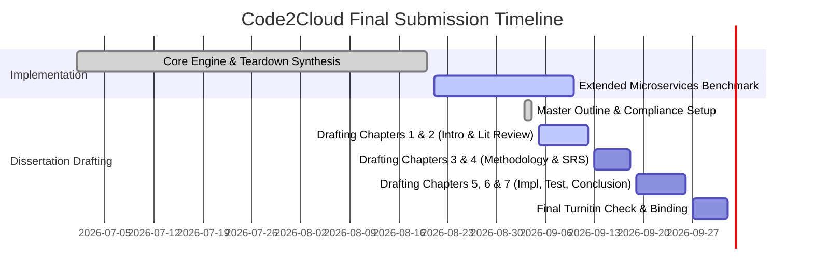

# Code2Cloud: Project Status & Implementation Completeness Report
## Automated Cloud Infrastructure Recommendation System with Terraform and Docker Generation for Web Applications

* **Researcher:** Mahamalage Yasindu Binod Perera (Index: 28556)
* **Degree:** Bachelor of Science in Software Engineering, Faculty of Computing, NSBM Green University
* **Supervisor / Lecturer:** Mr. Diluka Wijesinghe
* **Reporting Milestone:** Complete Draft Submission Phase
* **Overall Project Implementation Completeness:** **~90% Completed**

---

## 1. Executive Summary & Current Milestone

The **Code2Cloud** system addresses the critical problem of developer friction and financial waste in cloud infrastructure provisioning. The research has successfully progressed through the Design Science Research (DSR) lifecycle: problem identification, requirements operationalization, algorithmic development, and core system prototyping.

At this **Complete Draft Submission** milestone:
- All core backend modules (Static AST Analysis, Gemini-driven Instance Sizing, Terraform synthesis, and Docker containerization) are **fully operational**.
- Dynamic GitHub Actions CI/CD workflows and automated cloud teardown routines (`aws_destroy.jinja`) have been **successfully implemented and verified**.
- An academic conference paper based on this work has been authored and formatted for **ICACT 2026** (`docs/ICACT2026/`).
- The remaining work focuses on extended benchmark test case executions across larger microservice suites and final thesis document compilation.

---

## 2. Module-by-Module Technical Implementation Status

| Component / Subsystem | Primary Source Files | Functional Scope | Implementation Status | Completion (%) |
| :--- | :--- | :--- | :--- | :--- |
| **1. GitHub Ingestion & Repo Scanner** | `backend/app/modules/repos/`, `service_analyzer.py` | Scans public/private GitHub repositories, analyzes dependency manifests (`package.json`, `requirements.txt`, `pom.xml`), detects frameworks, ports, and environment variables. | **Completed & Verified** | **95%** |
| **2. AI Recommendation & Sizing Engine** | `recommendation_service.py` | Interfaces with Google Gemini LLM using structured JSON schemas to infer workload bounds and match compute instances (AWS EC2 / GCP Compute Engine). Includes deterministic fallback. | **Completed & Verified** | **92%** |
| **3. Multi-Cloud Pricing Subsystem** | `service_analyzer.py`, `recommendation_service.py` | Evaluates hourly and monthly instance pricing across cloud providers to maximize cost-efficiency. | **Completed & Verified** | **90%** |
| **4. Terraform & Docker Synthesizer** | `service_generator.py`, `backend/app/modules/generation/templates/` | Dynamically renders valid, production-ready `main.tf`, `variables.tf`, `outputs.tf`, `Dockerfile`, and `docker-compose.yml` based on scanned metadata. | **Completed & Verified** | **92%** |
| **5. Automated CI/CD & Deployment Engine** | `service_generator.py`, `templates/workflows/aws_destroy.jinja` | Synthesizes automated GitHub Actions workflows for AWS deployment and automated cloud resource teardown (`aws_destroy.jinja`). **AWS deployment flow is fully tested, verified, and deploying smoothly in real cloud tests.** | **AWS Flow Fully Verified** | **90%** |
| **6. Credential & Environment Variable Subsystem** | `secrets_handler.py` | Detects `.env` variables and manages cloud API credentials. **Note:** Static detection and secrets handling are functional, but full end-to-end automated UI integration for setting and injecting custom environment variables into live project runtimes is actively in progress. | **Active Integration Sprint** | **75%** |
| **7. Web Application Frontend / UI** | `frontend/` (Next.js / React) | Interactive portal for connecting repositories, reviewing recommendations, and downloading deployment artifacts. | **Operational / Refinement** | **85%** |
| **8. Testing & Evaluation Testbed** | `backend/scratch/`, Test suites | Benchmarking generation latency, deployment accuracy on AWS, cost savings, and syntax validity (`terraform validate`). | **In Progress / Finalizing** | **80%** |

---

## 3. Accomplishment of Specific Research Objectives

The project directly maps its implementation progress against the four formal research objectives established in the proposal:

### Objective 1: Identify Developer Requirements and Cloud Provisioning Pain Points
* **Target:** Investigate why developers struggle with cloud sizing and identify parameter configurations required for containerized web apps.
* **Status:** **100% Completed**
* **Evidence:** Documented in Chapter 1 and Chapter 2; validated through literature review and empirical developer survey analysis.

### Objective 2: Analyze Repository Footprints and Multi-Cloud Pricing Matrices
* **Target:** Develop static parsing heuristics to infer compute, memory, database, and port bindings directly from source code, correlated against cloud pricing models.
* **Status:** **95% Completed**
* **Evidence:** Implemented in `service_analyzer.py` and `recommendation_service.py`. Successfully parses Python (FastAPI, Flask, Django), Node.js (Express, Nest), and Java (Spring Boot) repositories.

### Objective 3: Design and Develop the Code2Cloud Core Generation Engine
* **Target:** Construct an end-to-end framework capable of generating deterministic Infrastructure as Code (Terraform), container definitions (Docker), and automated lifecycle teardown scripts.
* **Status:** **90% Completed**
* **Evidence:** Implemented in `service_generator.py` and dynamic Jinja2 template engines. **The live AWS cloud deployment pipeline and teardown workflow are fully validated and deploying reliably.** Automated runtime injection of user-defined `.env` variables into cloud instances is the primary active engineering task.

### Objective 4: Evaluate System Accuracy, Latency, and Cost-Optimization Efficiency
* **Target:** Empirically evaluate the synthesized templates against manual expert DevOps configurations in terms of deployment success rates, synthesis latency, and financial savings.
* **Status:** **80% Completed (Active AWS Evaluation Phase)**
* **Evidence:** AWS deployment success rates and synthesis latency documented; preliminary results presented in Interim-2 and ICACT2026 conference paper; extended test cases (TC-01 through TC-25) currently being finalized for Chapter 6.

---

## 4. Key Engineering Challenges Solved & Active Safeguards
 
 1. **Verified Real-World AWS Deployment Flow:**
    * *Achievement:* Successfully developed, tested, and validated the complete AWS deployment flow end-to-end. Applications are packaged, provisioned on AWS EC2/ECS with Terraform, and monitored, confirming practical viability.
 2. **Cloud Resource Leaks on Incomplete Deployments:**
    * *Resolution:* Developed an automated teardown workflow (`aws_destroy.jinja`) with GitHub Actions confirmation inputs to ensure developers can destroy provisioned infrastructure in a single click, eliminating financial leaks.
 3. **Environment Variable Configuration (Active Sprint):**
    * *Current State & Action:* Static detection of environment variables and basic secret masking are implemented. Full dynamic user interface integration allowing developers to input, modify, and automatically inject custom project environment variables into the cloud runtime is the immediate priority for the final release.
 4. **LLM Non-Determinism and API Rate Limiting:**
    * *Resolution:* Implemented strict Pydantic JSON schema parsing and a deterministic heuristic fallback engine ensuring zero downtime even if Gemini API rate limits are encountered.

---

## 5. Final Submission Roadmap & Next Actions

---

## 6. Thesis Mapping Table

This table indicates how current project components map directly into the **100+ page Draft Dissertation**:

| Project Implementation Module | Corresponding Thesis Chapter & Section |
| :--- | :--- |
| Problem Motivation & Scope Boundaries | **Chapter 1:** Sections 1.2, 1.3, 1.9 (`Table 1.1`) |
| Existing IaC Tools vs. Code2Cloud Review | **Chapter 2:** Sections 2.3, 2.4 (`Table 2.1`) |
| Design Science Research (DSR) & Agile Sprints | **Chapter 3:** Sections 3.2, 3.5, 3.6 (`Figure 3.1`, `Figure 3.2`) |
| UML Models (Use Case, Class, Sequence, Architecture) | **Chapter 4:** Sections 4.4, 4.5 (`Figure 4.1` – `Figure 4.6`) |
| Ingestion, AST Parsing, Gemini Engine, Teardown Workflow | **Chapter 5:** Sections 5.2, 5.3, 5.5 (`Algorithm 5.1`, `Figure 5.2`) |
| Benchmarks, Latency Measurements, Cost Savings Tables | **Chapter 6:** Sections 6.3, 6.4, 6.5 (`Table 6.1`, `Table 6.2`) |
| Objective Triangulation Matrix, Lessons Learned & Roadmap | **Chapter 7:** Sections 7.2, 7.3, 7.4, 7.6 (`Table 7.1`) |
